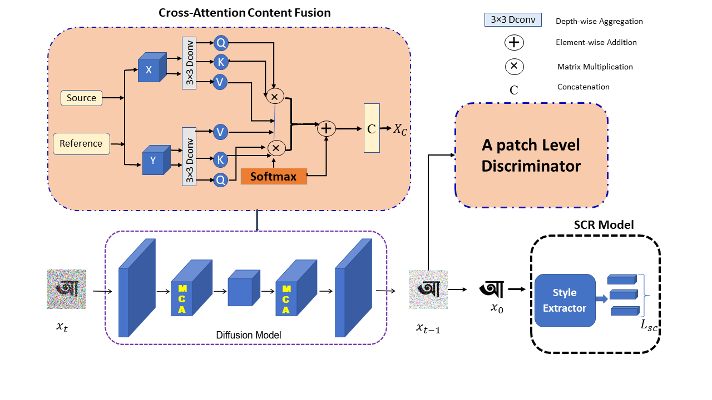
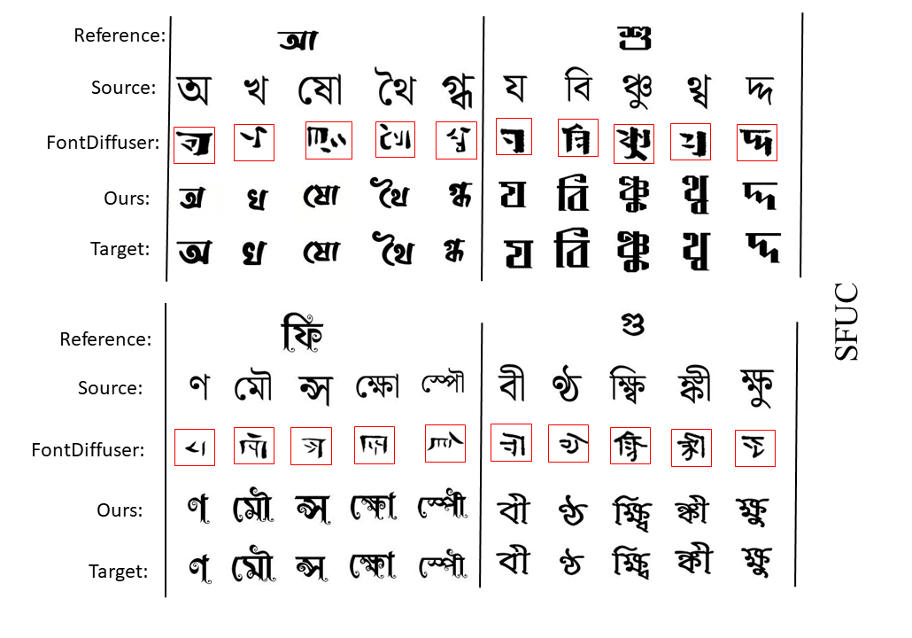
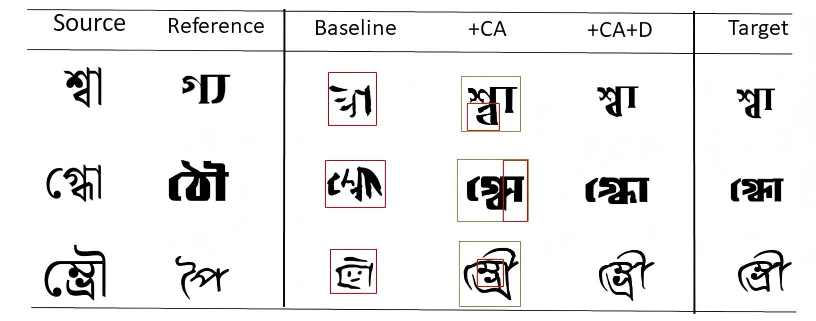

<div align="center">

# 🅱️ BengaliDiff

### Diffusion Model for Few-Shot Bengali Font Generation

**A diffusion-based generative framework for Bengali glyph synthesis from limited style references**

<br>

[](https://link.springer.com/chapter/10.1007/978-3-032-09371-4_7)
[](https://doi.org/10.1007/978-3-032-09371-4_7)


<br>

**Md Bilayet Hossain · Honghui Yuan · Shabnur Anonna Akhy · Keiji Yanai**

**ICDAR 2025 Workshops · Springer LNCS**

</div>

---

## 🔍 Overview

**BengaliDiff** is a diffusion-based research framework for **few-shot Bengali font generation**.

Bengali script presents unique challenges for generative font modeling due to its complex glyph structures, modifiers, compound characters, and substantial stylistic variations.

BengaliDiff investigates how a generative model can learn a target font style from a limited number of reference glyphs and transfer that visual style to other Bengali characters while preserving their structural identity.

The framework combines:

- **Content representation learning**
- **Style representation learning**
- **Attention-based content-style integration**
- **Diffusion-based image generation**
- **Adversarial supervision**
- **Efficient diffusion sampling**

> 📌 This repository contains the research implementation associated with our published BengaliDiff work.

---

## ✨ Research Highlights

- 🅱️ Bengali-specific font generation
- 🎨 Few-shot font style transfer
- 🌫️ Diffusion-based glyph synthesis
- 🧠 Content and style representation learning
- 🔗 Attention-based feature integration
- ⚔️ Adversarial supervision components
- ⚡ DPM-Solver++ accelerated sampling
- 🔬 SFUC and UFUC experimental evaluation

---

## 🏗️ Architecture

<p align="center">
  
</p>

<p align="center">
  <i>Overview of the BengaliDiff framework for few-shot Bengali font generation.</i>
</p>

The generation pipeline can be summarized as:

```text
Content Glyph ──────► Content Encoder ─────┐
                                          │
                                          ▼
                                 Content-Style Fusion
                                          │
                                          ▼
Reference Glyph ─────► Style Encoder ─────┘
                                          │
                                          ▼
                                   Diffusion U-Net
                                          │
                                          ▼
                                  Reverse Denoising
                                          │
                                          ▼
                                    DPM-Solver++
                                          │
                                          ▼
                              Generated Bengali Glyph
```

---

## 🖼️ Qualitative Results

<p align="center">
  
</p>

<p align="center">
  <i>Qualitative examples of Bengali glyph generation using BengaliDiff.</i>
</p>

The qualitative results demonstrate the ability of BengaliDiff to transfer visual font characteristics from reference glyphs while preserving Bengali character structures.

For detailed quantitative comparisons and experimental analysis, please refer to the published paper.

---

## 🧪 Ablation Study

<p align="center">
  
</p>

<p align="center">
  <i>Ablation analysis of the BengaliDiff framework.</i>
</p>

The ablation experiments investigate the contribution of different model components to style preservation and Bengali glyph generation quality.

---

## 📄 Publication

### BengaliDiff: Diffusion Model for Few-Shot Bengali Font Generation

**Authors:**  
Md Bilayet Hossain, Honghui Yuan, Shabnur Anonna Akhy, Keiji Yanai

**Published in:**  
*Document Analysis and Recognition – ICDAR 2025 Workshops*

**Lecture Notes in Computer Science (LNCS), Vol. 16226, pp. 101–115**  
Springer, Cham.

📖 **Paper:**  
https://link.springer.com/chapter/10.1007/978-3-032-09371-4_7

🔗 **DOI:**  
https://doi.org/10.1007/978-3-032-09371-4_7

---

## 📂 Repository Structure

```text
BengaliDiff/
│
├── configs/
│   └── fontdiffuser.py
│
├── dataset/
│   ├── collate_fn.py
│   └── font_dataset.py
│
├── data_examples/
│   ├── sampling/
│   │   ├── source_images/
│   │   └── reference_images/
│   │
│   └── train/
│       ├── ContentImage/
│       └── TargetImage/
│
├── figures/
│   ├── bengalidiff_architecture.png
│   ├── bengalidiff_qualitative_results.png
│   └── bengalidiff_ablation.png
│
├── scripts/
│   ├── sample_content_character.sh
│   ├── sample_content_image.sh
│   ├── train_phase_1.sh
│   └── train_phase_2.sh
│
├── src/
│   ├── dpm_solver/
│   ├── modules/
│   ├── build.py
│   ├── criterion.py
│   ├── discriminator.py
│   └── model.py
│
├── char_map.json
├── evaluation.py
├── gradio_app.py
├── requirements.txt
├── sample.py
├── train.py
├── train_disc.py
└── utils.py
```

---

## ⚙️ Installation

### 1. Clone the Repository

```bash
git clone https://github.com/bilayet5821/BengaliDiff-Diffusion-Model-Few-Shot-Bengali-Font-Generation.git
```

```bash
cd BengaliDiff-Diffusion-Model-Few-Shot-Bengali-Font-Generation
```

### 2. Create the Environment

```bash
conda create -n bengalidiff python=3.9 -y
conda activate bengalidiff
```

### 3. Install PyTorch

```bash
pip install torch==1.13.1+cu117 torchvision==0.14.1+cu117 torchaudio==0.13.1 --extra-index-url https://download.pytorch.org/whl/cu117
```

### 4. Install Dependencies

```bash
pip install -r requirements.txt
```

### 5. Configure Accelerate

```bash
accelerate config
```

---

## 📊 Dataset Preparation

The complete BengaliDiff research dataset is **not distributed with this repository**.

Researchers can prepare Bengali font data according to the structure expected by the dataset loader.

```text
DATA_ROOT/
│
└── train/
    │
    ├── ContentImage/
    │   ├── char01.jpg
    │   ├── char02.jpg
    │   ├── char03.jpg
    │   └── ...
    │
    └── TargetImage/
        │
        ├── FontStyle01/
        │   ├── FontStyle01+char01.jpg
        │   ├── FontStyle01+char02.jpg
        │   └── ...
        │
        └── FontStyle02/
            ├── FontStyle02+char01.jpg
            ├── FontStyle02+char02.jpg
            └── ...
```

### Naming Convention

Target glyph images follow:

```text
<style>+<content>.jpg
```

Example:

```text
AdorshoLipi+char01.jpg
```

with the corresponding content glyph:

```text
ContentImage/char01.jpg
```

---

## 🚀 Training

### Phase 1 — Main Diffusion Training

Run:

```bash
bash scripts/train_phase_1.sh
```

The primary training configuration is defined in:

```text
configs/fontdiffuser.py
```

Important parameters include:

```text
--data_root
--output_dir
--resolution
--train_batch_size
--max_train_steps
--learning_rate
--ckpt_interval
--drop_prob
```

---

### Phase 2 — Style-Contrastive Training

After obtaining the Phase 1 checkpoint:

```bash
bash scripts/train_phase_2.sh
```

Relevant configuration options include:

```text
--phase_2
--phase_1_ckpt_dir
--scr_ckpt_path
--sc_coefficient
--num_neg
```

---

## ⚔️ Adversarial Training

BengaliDiff also includes discriminator-related components used during model development:

```text
train_disc.py
src/discriminator.py
src/modules/discriminator.py
```

These components support the adversarial supervision experiments associated with BengaliDiff.

---

## 🎨 Inference

A trained checkpoint is required for generation.

Example checkpoint structure:

```text
ckpt/
├── unet.pth
├── content_encoder.pth
└── style_encoder.pth
```

Run image-based sampling using:

```bash
bash scripts/sample_content_image.sh
```

You can also inspect all available sampling arguments using:

```bash
python sample.py --help
```

Example images can be placed under:

```text
data_examples/
└── sampling/
    ├── source_images/
    │   └── source_01.jpg
    │
    └── reference_images/
        └── reference_01.jpg
```

> ⚠️ Pretrained BengaliDiff weights are not included in this repository.

---

## 📏 Evaluation

Evaluation utilities are available in:

```text
evaluation.py
```

BengaliDiff investigates font-generation performance under different generalization scenarios.

| Protocol | Meaning |
|:---:|---|
| **SFUC** | Seen Font, Unseen Character |
| **UFUC** | Unseen Font, Unseen Character |

For the exact dataset splits, quantitative results, evaluation metrics, and comparisons with existing methods, please refer to the published paper.

---

## 🔬 Reproducing BengaliDiff

To reproduce the research workflow:

1. Prepare Bengali glyph images using the required directory structure.
2. Install the research environment and dependencies.
3. Configure the dataset and output paths.
4. Train the Phase 1 diffusion model.
5. Run the subsequent training stage required by the experiment.
6. Generate Bengali glyphs using the sampling pipeline.
7. Evaluate the generated glyphs.
8. Compare the results following the experimental protocol described in the paper.

Large datasets, checkpoints, experiment outputs, OCR weights, and training logs are intentionally excluded from this public repository.

---

## ⚠️ Limitations

BengaliDiff is a **research implementation** rather than a production font-design system.

Generation quality depends on:

- training font diversity,
- quality of reference glyphs,
- complexity of Bengali characters,
- training configuration, and
- available computational resources.

Reproducing the exact published results requires following the experimental configuration described in the paper.

---

## 🙏 Acknowledgements

BengaliDiff builds upon the open-source **FontDiffuser** research implementation:

> **FontDiffuser: One-Shot Font Generation via Denoising Diffusion with Multi-Scale Content Aggregation and Style Contrastive Learning**

Zhenhua Yang, Dezhi Peng, Yuxin Kong, Yuyi Zhang, Cong Yao, and Lianwen Jin.

**AAAI 2024**

Repository:

https://github.com/yeungchenwa/FontDiffuser

We gratefully acknowledge the FontDiffuser authors for making their research implementation publicly available.

BengaliDiff adapts and extends this foundation for **few-shot Bengali font generation**.

---

## 📝 Citation

If you use BengaliDiff in your research, please cite:

```bibtex
@inproceedings{hossain2026bengalidiff,
  title     = {BengaliDiff: Diffusion Model for Few-Shot Bengali Font Generation},
  author    = {Hossain, Md Bilayet and Yuan, Honghui and
               Akhy, Shabnur Anonna and Yanai, Keiji},
  booktitle = {Document Analysis and Recognition -- ICDAR 2025 Workshops},
  series    = {Lecture Notes in Computer Science},
  volume    = {16226},
  pages     = {101--115},
  year      = {2026},
  publisher = {Springer},
  doi       = {10.1007/978-3-032-09371-4_7}
}
```

---

## ⚖️ Usage Notice

This repository contains code adapted from the **FontDiffuser** research implementation.

Users should review and comply with the applicable terms and notices of the original FontDiffuser repository.

Please cite **BengaliDiff** and the underlying **FontDiffuser** work when appropriate.

---

<div align="center">

## ⭐ BengaliDiff

### Advancing Generative AI for Bengali Script

[**📄 Read the Paper**](https://link.springer.com/chapter/10.1007/978-3-032-09371-4_7)
&nbsp;&nbsp; • &nbsp;&nbsp;
[**🔗 DOI**](https://doi.org/10.1007/978-3-032-09371-4_7)

<br>

**Computer Vision • Generative AI • Diffusion Models • Bengali Font Generation**

<br>

If you find this repository useful for your research, consider giving it a ⭐.

</div>